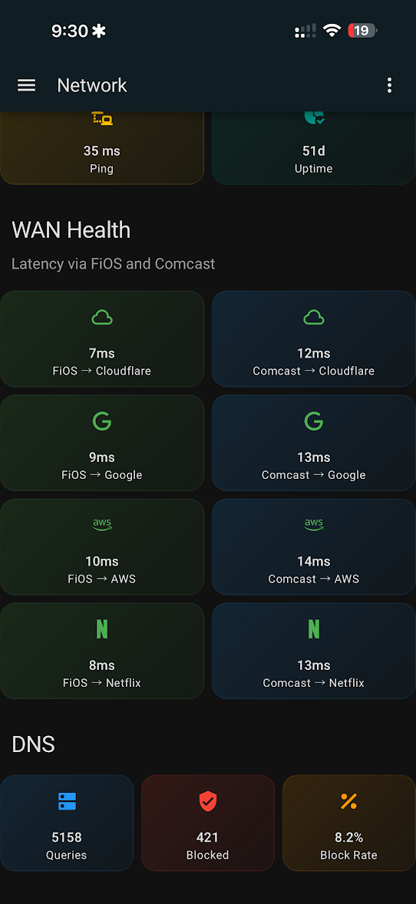

# SmokePing to Home Assistant Integration

[](https://opensource.org/licenses/MIT)
[](https://www.home-assistant.io/)
[](https://oss.oetiker.ch/smokeping/)
[](https://www.python.org/)

A lightweight integration that exposes SmokePing latency data to Home Assistant via REST sensors. Monitor your WAN health, compare ISP performance, and get alerts when network issues occur.

<!-- Add your own screenshot:  -->

## Features

- **Real-time latency monitoring** - Poll SmokePing RRD data every 60 seconds
- **Multi-ISP support** - Compare latency across different WAN connections
- **Color-coded dashboard cards** - Green/yellow/red based on latency thresholds
- **Smart alerting** - Push notifications with cooldown to prevent spam
- **Zero dependencies** - Uses only Python standard library + rrdtool CLI
- **Configurable** - Environment variables for all settings
- **Secure by default** - Binds to localhost only; explicit opt-in for network access

## How It Works

```
┌─────────────────┐     ┌─────────────────┐
│  SmokePing      │     │  SmokePing      │
│  Server 1       │     │  Server 2       │
│  (ISP A)        │     │  (ISP B)        │
│       ↓         │     │       ↓         │
│ smokeping-api   │     │ smokeping-api   │
│   :8080         │     │   :8080         │
└────────┬────────┘     └────────┬────────┘
         │                       │
         └───────────┬───────────┘
                     │ HTTP/JSON
              ┌──────▼──────┐
              │ Home        │
              │ Assistant   │
              │ REST Sensors│
              └──────┬──────┘
                     │
         ┌───────────┴───────────┐
         │                       │
    ┌────▼────┐           ┌──────▼──────┐
    │Dashboard│           │ Automations │
    │ Cards   │           │   Alerts    │
    └─────────┘           └─────────────┘
```

## Quick Start

### 1. Install the API on your SmokePing server(s)

```bash
# Install rrdtool
sudo apt update && sudo apt install -y rrdtool

# Download and install the API
sudo curl -o /usr/local/bin/smokeping_api.py \
  https://raw.githubusercontent.com/rplancha/smokeping-ha/main/api/smokeping_api.py
sudo chmod +x /usr/local/bin/smokeping_api.py

# Install and start the service
sudo curl -o /etc/systemd/system/smokeping-api.service \
  https://raw.githubusercontent.com/rplancha/smokeping-ha/main/api/smokeping-api.service
sudo systemctl daemon-reload
sudo systemctl enable --now smokeping-api

# Verify it's working
curl http://localhost:8080/
```

### 2. Configure Home Assistant

Add to your `configuration.yaml`:

```yaml
rest: !include smokeping_sensors.yaml
```

Copy `homeassistant/sensors/smokeping_sensors.yaml` to your HA config directory and update the server hostnames.

### 3. Restart Home Assistant

The sensors will appear as:
- `sensor.primary_cloudflare_latency`
- `sensor.secondary_cloudflare_latency`
- etc.

## Configuration

### Environment Variables

The API can be configured via environment variables. Set these in the systemd service file or export them before running:

| Variable | Default | Description |
|----------|---------|-------------|
| `SMOKEPING_API_BIND_ADDRESS` | `127.0.0.1` | Address to bind to. Set to `0.0.0.0` for network access |
| `SMOKEPING_API_PORT` | `8080` | Port to listen on |
| `SMOKEPING_API_DATA_DIR` | `/var/lib/smokeping` | Path to SmokePing RRD data directory |
| `SMOKEPING_API_TOTAL_PINGS` | `20` | Number of pings per SmokePing probe cycle |
| `SMOKEPING_API_ISP` | Auto-detected | ISP/connection identifier (e.g., "fios", "comcast", "primary") |

Example systemd override:

```ini
[Service]
Environment=SMOKEPING_API_BIND_ADDRESS=0.0.0.0
Environment=SMOKEPING_API_PORT=9090
```

### Target Configuration

Edit the `TARGETS` dictionary in `smokeping_api.py` to match your SmokePing targets:

```python
TARGETS = {
    "cloudflare": "external/cloudflare.rrd",
    "google": "external/google_dns.rrd",
    "aws": "external/aws_use1.rrd",
    "netflix": "netflix/nflx_was.rrd",
}
```

Find your RRD files with: `find /var/lib/smokeping -name "*.rrd"`

### ISP Detection

The ISP name is auto-detected from the hostname. Customize the `detect_isp()` function in the script if needed.

### Home Assistant Sensors

The sensor configuration polls the API every 60 seconds. Each sensor includes:
- **State**: Latency in milliseconds
- **Attributes**: `loss_pct`, `timestamp`

### Dashboard Cards

See `examples/dashboard-cards.yaml` for Mushroom card examples with color-coded status.

**Latency thresholds used in dashboard:**
- Green: < 30ms (Excellent)
- Amber: 30-75ms (Acceptable)
- Red: > 75ms (Degraded)

### Automations

See `homeassistant/automations/` for alert templates:
- **WAN Degraded** - Alert when latency > 100ms for 10 minutes
- **WAN Recovered** - Notify when latency returns to normal
- **Both WANs Degraded** - Critical alert when all connections are affected
- **Packet Loss** - Alert when loss > 10%

Features:
- 10-minute sustained threshold before alerting
- 1-hour cooldown between alerts
- Recovery notifications only if an alert was sent

## Security Considerations

### Network Binding

By default, the API binds to `127.0.0.1` (localhost only) for security. This means:
- Only local connections are accepted
- Home Assistant on the same machine can access it
- Remote Home Assistant instances cannot connect

To allow network access (required when HA is on a different machine):

```bash
# In systemd service file
Environment=SMOKEPING_API_BIND_ADDRESS=0.0.0.0
```

**Important**: When binding to `0.0.0.0`, ensure proper firewall rules are in place. The API has no authentication.

### CORS

The API sets `Access-Control-Allow-Origin: *` to allow cross-origin requests. This is safe for local network use but should be considered if exposing to the internet.

### Recommendations

1. **Use a firewall** - Only allow connections from your Home Assistant IP
2. **Use a reverse proxy** - Add authentication via nginx/Caddy if needed
3. **Don't expose to internet** - Keep the API on your local network only

## API Reference

### Endpoints

| Endpoint | Description |
|----------|-------------|
| `GET /` | Returns all target latencies as JSON |
| `GET /metrics` | Alias for `/` |
| `GET /health` | Health check endpoint |
| `GET /target/<name>` | Returns single target data |

### Response Format

```json
{
  "targets": {
    "cloudflare": {
      "latency_ms": 12.5,
      "loss_pct": 0.0,
      "timestamp": "2024-01-15T10:30:00+00:00"
    }
  },
  "isp": "fios",
  "hostname": "pi",
  "collected_at": "2024-01-15T10:30:05+00:00"
}
```

## Requirements

### SmokePing Server
- SmokePing 2.8+ with RRD data
- Python 3.9+
- `rrdtool` package (`apt install rrdtool`)

### Home Assistant
- Home Assistant 2024.1+
- REST integration (built-in)
- Optional: Mushroom Cards for dashboard

## Development

### Setup

```bash
# Clone the repository
git clone https://github.com/rplancha/smokeping-ha.git
cd smokeping-ha

# Install dependencies (using uv)
uv sync --dev

# Or using pip
pip install -e ".[dev]"
```

### Running Tests

```bash
# Run all tests
uv run pytest

# Run with coverage
uv run pytest --cov=api

# Run specific test
uv run pytest tests/test_smokeping_api.py::TestParseRrdLastupdate
```

### Linting and Type Checking

```bash
# Run linter
uv run ruff check .

# Run formatter
uv run ruff format .

# Run type checker
uv run mypy api/ tests/
```

### Code Quality

This project uses:
- **pytest** for testing
- **ruff** for linting and formatting
- **mypy** for type checking

All checks must pass before merging.

## Troubleshooting

### API returns "rrdtool not installed"
```bash
sudo apt install rrdtool
```

### Sensors show "unavailable"
1. Check API is running: `curl http://your-server:8080/`
2. Check HA can reach the server (firewall, DNS)
3. Check HA logs for REST sensor errors
4. Ensure `SMOKEPING_API_BIND_ADDRESS=0.0.0.0` is set if HA is on a different machine

### Service won't start
```bash
sudo journalctl -u smokeping-api -n 50
```

Common issues:
- Wrong user in service file (change `User=smokeping` to `User=pi`)
- RRD files not readable
- Port already in use

### Path traversal error
If you see "Invalid path" errors, ensure your RRD paths in `TARGETS` are relative paths within `SMOKEPING_DATA_DIR` and don't contain `..`.

## Contributing

Contributions are welcome! Please:
1. Fork the repository
2. Create a feature branch
3. Write tests for new functionality
4. Ensure all checks pass (`pytest`, `ruff`, `mypy`)
5. Submit a pull request

## License

MIT License - see [LICENSE](LICENSE) for details.

## Acknowledgments

- [SmokePing](https://oss.oetiker.ch/smokeping/) by Tobi Oetiker
- [Home Assistant](https://www.home-assistant.io/) community
- [Mushroom Cards](https://github.com/piitaya/lovelace-mushroom) for beautiful dashboard components
- [Claude](https://claude.ai/) by Anthropic and [OpenCode](https://github.com/opencode-ai/opencode) for AI-assisted development
